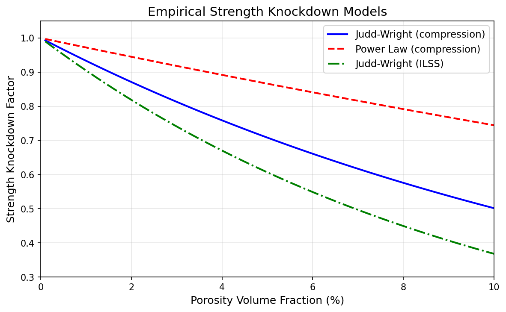
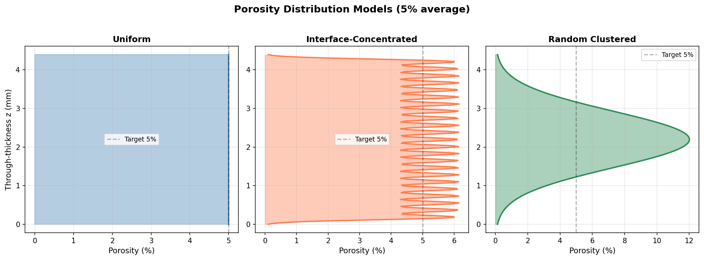
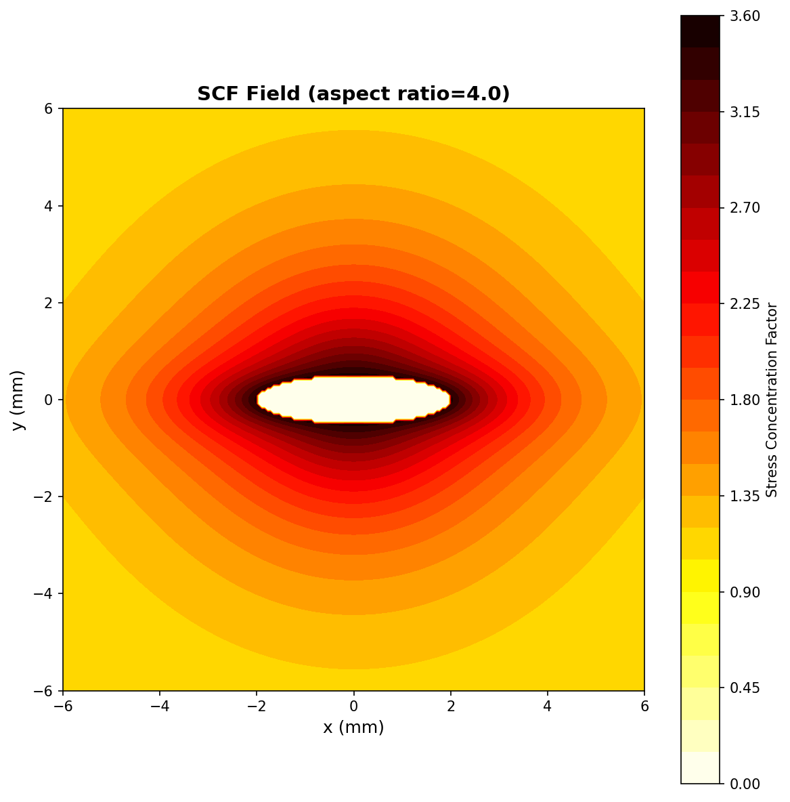

# PorosityFE

[](https://opensource.org/licenses/MIT)
[](https://www.python.org/downloads/)
[](https://github.com/elhajjar1/PorosityFE/actions/workflows/tests.yml)
[](https://github.com/elhajjar1/PorosityFE/actions/workflows/build-executables.yml)
[](https://github.com/elhajjar1/PorosityFE/releases)

A desktop application and Python library for predicting how porosity defects degrade the strength and stiffness of fiber-reinforced composite laminates.

## Why This Tool?

Manufacturing defects like porosity are inevitable in composite structures. Engineers need to quantify how much strength is lost for a given porosity level, void morphology, and loading mode. PorosityFE provides:

- **Fast empirical screening** using calibrated Judd-Wright and power-law models
- **3D finite element analysis** with Eshelby-based stiffness degradation at each element
- **Layup-aware predictions** that account for how ply orientation affects porosity sensitivity
- **Interactive GUI** for rapid parametric studies without writing code



## Features

- **Two porosity types**: Distributed microporosity (continuous field) + discrete macrovoids (explicit geometry)
- **Five distribution models**: Uniform, interface-concentrated, clustered (midplane/surface), layup-dependent
- **Three void morphologies**: Spherical, cylindrical (prolate), penny-shaped (oblate)
- **Four loading modes**: Compression, tension, shear, ILSS
- **Two solver tiers**: Empirical correlations (fast) + 3D finite element (detailed)
- **Three material presets**: T800/epoxy, T700/epoxy, E-glass/epoxy (or define your own)
- **Discrete void modeling**: Explicit ellipsoidal voids with stress concentration factors
- **Tsai-Wu failure criterion**: Full 3D multiaxial strength evaluation

## Visualizations

### Porosity Distribution Models


### Void Stress Concentration Field


## Installation

### From source (recommended)
```bash
git clone https://github.com/elhajjar1/PorosityFE.git
cd PorosityFE
pip install -e ".[all]"
```

### Dependencies only
```bash
pip install numpy scipy matplotlib PyQt6
```

### Run tests
```bash
pytest tests/ -v
```

## Usage

### Desktop GUI
```bash
python porosity_gui.py
```

### Command-line analysis
```bash
python porosity_fe_analysis.py
```
Runs the full analysis across 5 porosity levels (1%-8%) and 5 configurations, generating PNG plots and JSON results.

### Python library
```python
from porosity_fe_analysis import *

# Quick empirical screening
material = MATERIALS['T800_epoxy']
pf = PorosityField(material, 0.05, distribution='interface', void_shape='penny')
mesh = CompositeMesh(pf, material, nx=50, ny=20, nz=24)

solver = EmpiricalSolver(mesh, material)
result = solver.get_failure_load(mode='compression', model='judd_wright')
print(f"Knockdown: {result['knockdown']:.3f}")

# Compare all configurations at 3% porosity
results = compare_configurations(0.03, material_name='T800_epoxy')
```

### Build macOS GUI app
```bash
pip install pyinstaller
python -m PyInstaller PorosityFE.spec --noconfirm --clean
# App at dist/PorosityFE.app
```

### Build validate_porosity CLI executable (Linux / macOS / Windows)
```bash
pip install pyinstaller
python -m PyInstaller ValidatePorosity.spec --noconfirm --clean
# Linux/macOS: dist/validate_porosity/validate_porosity
# Windows:     dist\validate_porosity\validate_porosity.exe
```

Pre-built executables for all three platforms are produced automatically
by GitHub Actions on every push; download them from the Actions tab
(artifact names: `validate_porosity-linux`, `-macos`, `-windows`) or
from the Releases page for tagged versions.

CLI usage:
```bash
validate_porosity --help             # show all options
validate_porosity                    # run against bundled datasets, write to cwd
validate_porosity --output-dir /tmp  # write reports elsewhere
validate_porosity --quiet            # suppress progress output
```

## Output Files

| File Pattern | Description |
|---|---|
| `porosity_profile_*.png` | Through-thickness porosity profiles |
| `porosity_mesh_3d_*.png` | 3D mesh with hexahedral elements |
| `porosity_mesh_detail_*.png` | Cross-section element detail |
| `porosity_damage_*.png` | Stiffness reduction contour maps |
| `porosity_comparison_*.png` | Model comparison bar charts |
| `porosity_knockdown_curves.png` | Knockdown vs porosity curves |
| `porosity_analysis_results_*.json` | Numerical results (JSON) |

## Physics Models

### Empirical Strength Knockdown

**Judd-Wright** (exponential decay):
```
KD = exp(-alpha * Vp)
```

**Power Law**:
```
KD = (1 - Vp)^n
```

Coefficients are layup-dependent: matrix-dominated layups (many off-axis plies) are more sensitive to porosity than fiber-dominated layups.

### Finite Element Solver

The FE solver builds a 3D hexahedral mesh and degrades element stiffness based on local porosity:

1. **Eshelby inclusion theory** computes degraded matrix properties (voids as zero-stiffness ellipsoids)
2. **Micromechanics rules** map matrix degradation to composite degradation ratios for E11, E22, G12
3. **Tsai-Wu criterion** evaluates multiaxial failure at each integration point

#### How porosity is applied across plies

The user supplies a single global porosity value `Vp`, but it is **not** applied
as a uniform knockdown to every ply. Instead, `Vp` defines the *volume-average*
porosity of the laminate; the chosen distribution model determines how that
porosity is spatially redistributed through the thickness:

| `distribution` | Through-thickness porosity profile |
|---|---|
| `'uniform'` | Constant `Vp` at every ply |
| `'clustered'` + `cluster_location='midplane'` | Peaks near the laminate midplane, near-zero at the surfaces |
| `'clustered'` + `cluster_location='surface'` | Peaks at the outer surfaces, near-zero at the midplane |
| `'interface'` | Concentrated at ply interfaces; matrix-rich resin layers see higher local Vp |

The volume-average porosity is renormalized to `Vp` for every distribution, so
two runs with the same `Vp` but different distributions inject the same total
void content — only the through-thickness location of that void content
changes.

At solve time, each Gauss point reads its **local** porosity from the field
profile evaluated at the point's z-coordinate, then the degraded composite
stiffness is computed for that ply orientation and rotated into the global
frame. As a result, modulus reduction is **ply-by-ply**: two plies with the
same orientation but different z-locations can have different effective
stiffness, and two plies at the same z but different orientations see
different directional knockdowns even when their local Vp is identical.

The only case where the reduction is uniform across plies is the `uniform`
distribution applied to a laminate of identical orientation — a rare scenario
in practice.

### Failure Criterion

Full 3D Tsai-Wu with degraded strengths:
```
F1*s1 + F2*s2 + F11*s1^2 + F22*s2^2 + F66*s6^2 + 2*F12*s1*s2 = 1
```

## Validation

PorosityFE is validated against **13 peer-reviewed experimental datasets**
covering carbon/epoxy, IM7/toughened epoxy, T300/epoxy systems, and
CF/PEEK thermoplastic. Validation is automated via `validate_porosity`
CLI (pre-built for Linux/macOS/Windows on the [Releases page](https://github.com/elhajjar1/PorosityFE/releases))
or in-process via `validation/validate_all.py`.

**Model scope (validated properties):**

| Property | # papers | Overall MAE |
|---|---|---|
| ILSS (short-beam shear) | 9 | 4.3% |
| Tensile strength | 7 | 6.9% |
| Tensile modulus | 3 | 1.3% |
| Transverse tensile modulus | 3 | 3.4% |
| Flexural modulus (D-matrix CLT) | 5 | 8.9% |
| Compression strength | 2 | 11.4% |
| Shear strength | 2 | 13.5% |
| Transverse tensile strength | 3 | 14.5% |
| Shear modulus (A-matrix CLT) | 1 | 15.4% |

Overall MAE: **7.7%** across 35 (paper, property) pairs.

## Limitations

- Empirical models are calibrated for porosity levels up to ~10%
- FE solver uses analytical stiffness degradation (not full nonlinear FE)
- Thermal residual stresses are not included
- Fatigue and environmental effects are not modeled
- Delamination initiation/propagation is not explicitly simulated
- **Flexural strength** was removed from the validation database in v1.1.1
  because 3-point bend failure involves mixed compression + interlaminar
  shear mechanisms that the Judd-Wright mode proxy cannot capture reliably
  (observed MAE 8-40% across papers)

## Citation

If you use PorosityFE in your research, please cite:

```bibtex
@software{elhajjar2026porosityfe,
  author = {Elhajjar, Rani},
  title = {{PorosityFE}: Porosity-Degraded Composite Laminate Analysis},
  year = {2026},
  url = {https://github.com/elhajjar1/PorosityFE},
  version = {1.0.0}
}
```

Related publication:
> Elhajjar, R. (2025). Fat-tailed failure strength distributions and manufacturing defects in advanced composites. *Scientific Reports*, 15, 25977. [DOI: 10.1038/s41598-025-06693-4](https://doi.org/10.1038/s41598-025-06693-4)

## References

- Judd & Wright (1986) - Voids and their effects on mechanical properties of composites
- Eshelby (1957) - The determination of the elastic field of an ellipsoidal inclusion
- Mura (1987) - Micromechanics of Defects in Solids
- Tsai & Wu (1971) - A general theory of strength for anisotropic materials
- Elhajjar (2025) - Fat-tailed failure strength distributions and manufacturing defects

## Contributing

See [CONTRIBUTING.md](CONTRIBUTING.md) for guidelines on reporting bugs, suggesting features, and submitting pull requests.

## License

MIT License. See [LICENSE](LICENSE) for details.
