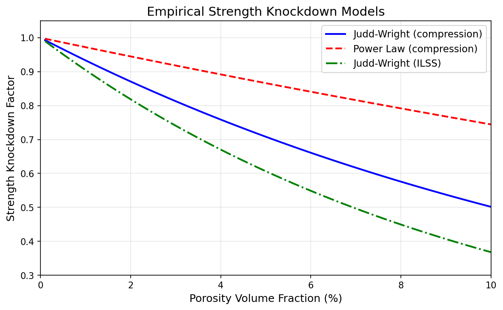
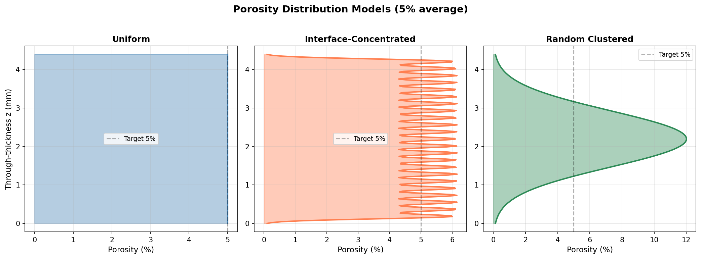
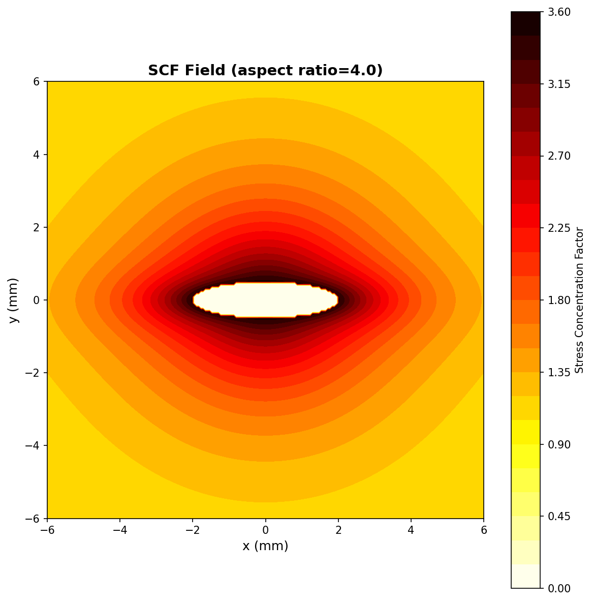

# PorosityFE

[](https://opensource.org/licenses/MIT)
[](https://www.python.org/downloads/)
[](https://github.com/elhajjar1/PorosityFE/actions/workflows/tests.yml)
[](https://github.com/elhajjar1/PorosityFE/actions/workflows/build-executables.yml)
[](https://github.com/elhajjar1/PorosityFE/releases)

A Streamlit web app and Python library for predicting how porosity defects degrade the strength and stiffness of fiber-reinforced composite laminates.

## Why This Tool?

Manufacturing defects like porosity are inevitable in composite structures. Engineers need to quantify how much strength is lost for a given porosity level, void morphology, and loading mode. PorosityFE provides:

- **Fast empirical screening** using calibrated Judd-Wright and power-law models
- **3D finite element analysis** with Eshelby-based stiffness degradation at each element
- **Layup-aware predictions** that account for how ply orientation affects porosity sensitivity
- **Interactive web app** for rapid parametric studies without writing code



## Features

- **Two porosity types**: Distributed microporosity (continuous field) + discrete macrovoids (explicit geometry)
- **Three distribution models**: Uniform, clustered (midplane/surface/quarter), interface-concentrated
- **Three void morphologies**: Spherical, cylindrical (prolate), penny-shaped (oblate)
- **Four loading modes**: Compression, tension, shear, ILSS
- **Three empirical knockdown models**: Judd-Wright (exponential), power-law, linear
- **Two solver tiers**: Empirical correlations (fast) + 3D finite element (detailed)
- **Six material presets**: T800/epoxy, T700/epoxy, E-glass/epoxy, IM7/8551, T300/934, CF/PEEK (or define your own)
- **Discrete void modeling**: Explicit ellipsoidal voids with elasticity-based (Eshelby cavity solution) stress concentration factors
- **Tsai-Wu failure criterion**: Full 3D multiaxial strength evaluation

## Visualizations

### Porosity Distribution Models


### Void Stress Concentration Field


## Installation

### From source (recommended)
```bash
git clone https://github.com/elhajjar1/PorosityFE.git
cd PorosityFE
pip install -e ".[all]"
```

### Dependencies only
```bash
pip install -r requirements.txt              # core (CLI + library)
pip install -r requirements-web.txt          # add Streamlit for the web app
```

`requirements.txt` covers the CLI and Python library only. Streamlit is an
optional `web` extra (see `pyproject.toml`); install it via
`requirements-web.txt` or `pip install -e ".[web]"` if you want to run
`streamlit run app.py`.

### Run tests
The tests import the installed package, so install it first:
```bash
pip install -e ".[dev]"     # or ".[all]" to include the Streamlit app tests
pytest tests/ -v
```

## Usage

### Web app (Streamlit)
```bash
streamlit run app.py
```
Opens a browser UI at http://localhost:8501 with sidebar inputs (material, layup,
porosity, loading mode, mesh) and tabs for the porosity profile, mesh,
knockdown bar chart, FE stress contours, and result downloads. See
[`DEPLOYMENT_STREAMLIT.md`](DEPLOYMENT_STREAMLIT.md) for hosting on Streamlit
Community Cloud.

### Command-line analysis
```bash
porosity-analyze
```
Runs the full analysis across 5 porosity levels (1%-8%) and 5 configurations, generating PNG plots and JSON results.

### Uncertainty propagation

```bash
porosity-analyze --vp 0.02 0.04 --uq --uq-samples 500 --seed 1
```
`--uq` propagates input scatter through the empirical Judd-Wright knockdown
for every loading mode and writes `porosity_uq_<Vp>.json` with the mean, std
and p5/p50/p95 of the knockdown and failure stress. The sampled inputs are:
- the law's calibration coefficient (`--uq-coef-cov`, default 0.10), usually
  the dominant term;
- the measured mean porosity (`--uq-vp-cov`, default 0.10);
- each mode's pristine strength (`--uq-strength-cov`, default 0.05).

The default CoVs are assumptions; replace them with values from your own
data. The web app's Results tab has the same analysis in an
**Uncertainty** expander, with a knockdown histogram. From Python:

```python
from porosity_fe import propagate_uncertainty
r = propagate_uncertainty(0.03, 'T800_epoxy', 'compression', coef_cov=0.1,
                          vp_cov=0.1, n_samples=1000, method='lhs', seed=0)
print(r['knockdown']['percentiles'])   # {'p5': ..., 'p50': ..., 'p95': ...}
```

### Python library
```python
from porosity_fe import *

# Quick empirical screening
material = MATERIALS['T800_epoxy']
pf = PorosityField(material, 0.05, distribution='interface', void_shape='penny')
mesh = CompositeMesh(pf, material, nx=50, ny=20, nz=24)

solver = EmpiricalSolver(mesh, material)
result = solver.get_failure_load(mode='compression', model='judd_wright')
print(f"Knockdown: {result.knockdown:.3f}")

# Compare all configurations at 3% porosity
results = compare_configurations(0.03, material_name='T800_epoxy')
```

### Defining a custom material

Six material presets are available in the `MATERIALS` dict (see the
[Features](#features) list). To analyze a system that isn't in the built-in
set, construct a `MaterialProperties` instance directly and pass it through
the analysis pipeline — there is no separate registration step required.

```python
from porosity_fe import MaterialProperties, PorosityField, CompositeMesh, EmpiricalSolver

# Define a custom T700 / toughened-epoxy system
my_material = MaterialProperties(
    # Stiffness (MPa)
    E11=140000.0, E22=10500.0, E33=10500.0,
    G12=4900.0,   G13=4900.0,  G23=3700.0,
    nu12=0.30,    nu13=0.30,   nu23=0.42,
    # Strength (MPa)
    sigma_1c=1300.0, sigma_1t=2500.0,
    sigma_2t=70.0,   sigma_2c=210.0,
    tau_12=90.0,     tau_ilss=85.0,
    # Geometry
    t_ply=0.180,  n_plies=24,
    # Constituents (used by the FE solver's micromechanics path)
    matrix_modulus=3400.0,  matrix_poisson=0.36,
    fiber_modulus=240000.0, fiber_volume_fraction=0.60,
)

pf = PorosityField(my_material, void_volume_fraction=0.03, distribution='uniform')
mesh = CompositeMesh(pf, my_material, nx=30, ny=10, nz=12)
solver = EmpiricalSolver(mesh, my_material)
print(solver.get_failure_load(mode='compression', model='judd_wright'))
```

Notes:
- All stiffnesses and strengths are **MPa**; thicknesses are **mm**.
- All `MaterialProperties` fields are required — there are no defaults for
  the engineering constants. Cross-check anisotropy bounds (`ν12 < 0.5`,
  `E11 > E22`, etc.) before running.
- Optional thermal inputs `alpha_1`, `alpha_2`, `alpha_3` (CTEs in **1/K**,
  e.g. `alpha_2=26e-6`, not `26`) and `T_stress_free` (°C) default to
  `None`; they are stored for a planned thermal load case and no solver
  uses them yet.
- The FE micromechanics path uses `matrix_modulus`, `matrix_poisson`,
  `fiber_modulus`, and `fiber_volume_fraction` to compute the Eshelby
  stiffness degradation. Supply realistic constituent values even if you
  only plan to run the empirical solver — both paths share the same
  `MaterialProperties` object.
- To use this material with the included CLI / batch scripts, you can also
  add it to the `MATERIALS` dict in `porosity_fe/materials.py` so it can be
  selected by name (`compare_configurations(..., material_name='my_system')`).
- The empirical knockdown coefficients (`alpha`, `n`, `beta`) live on
  `EmpiricalSolver`, not on `MaterialProperties`. To recalibrate them for
  a non-standard material system, see
  [Calibrating `alpha` / `n` for a custom material](#calibrating-alpha--n-for-a-custom-material).

### Documentation

The Sphinx site under `docs/` holds the theory pages (micromechanics,
knockdown laws, CLT, failure criteria, fatigue), a CLI reference and the
full API reference. Build it locally with:

```bash
pip install -e ".[docs]"
python -m sphinx -b html docs docs/_build/html   # open docs/_build/html/index.html
```

## Examples

Runnable scripts under [`examples/`](examples/) cover the most common
configurations end-to-end. Each script is standalone (~30–50 lines), prints
a short result table, and saves a single PNG to `examples/output/` (which
is gitignored). Run any of them from the repo root:

```bash
python examples/uniform_spherical.py
```

| Script | What it demonstrates |
|---|---|
| [`examples/uniform_spherical.py`](examples/uniform_spherical.py) | Uniform porosity, spherical voids; empirical compression knockdown (Judd-Wright). |
| [`examples/clustered_midplane.py`](examples/clustered_midplane.py) | Gaussian-clustered porosity at the midplane; ILSS knockdown. |
| [`examples/interface_penny.py`](examples/interface_penny.py) | Interface-concentrated porosity with penny-shaped voids — the worst-case ILSS morphology. |
| [`examples/discrete_voids.py`](examples/discrete_voids.py) | Explicit `VoidGeometry` ellipsoids on top of a low-uniform background; renders the SCF field around one void. |
| [`examples/compute_degraded_clt_moduli.py`](examples/compute_degraded_clt_moduli.py) | CLT path: laminate effective moduli `(Ex, Ey, Gxy)` vs. `Vp` for a quasi-isotropic layup. |
| [`examples/distribution_comparison.py`](examples/distribution_comparison.py) | Side-by-side `uniform` vs `clustered` vs `interface` at matched `Vp_mean`; shows empirical KDs collapse, FE KDs diverge (#83). |

In addition to the `mode` / `model` kwargs shown above, `EmpiricalSolver.get_failure_load`
also accepts an `environment=` kwarg (hygrothermal knockdown — temperature
and moisture; PR #59) and a `cycles=` kwarg (fatigue knockdown). Both
compose multiplicatively with the porosity knockdown; see the
`EmpiricalSolver.get_failure_load` docstring for the accepted shapes and
defaults.

See [`examples/README.md`](examples/README.md) for the full index and the
conventions reminder. Math conventions (Voigt order, engineering vs. tensor
strain, compression-sign) are documented at the API surface — look for the
**Notes** block on `MaterialProperties.get_stiffness_matrix`,
`Hex8Element.B_matrix`, `FieldResults`, and `EmpiricalSolver.apply_loading`.

### Build validate_porosity CLI executable (Linux / macOS / Windows)
```bash
pip install pyinstaller
python -m PyInstaller ValidatePorosity.spec --noconfirm --clean
# Linux/macOS: dist/validate_porosity/validate_porosity
# Windows:     dist\validate_porosity\validate_porosity.exe
```

Pre-built executables for all three platforms are produced automatically
by GitHub Actions on every push; download them from the Actions tab
(artifact names: `validate_porosity-linux`, `-macos`, `-windows`) or
from the Releases page for tagged versions.

CLI usage:
```bash
validate_porosity --help             # show all options
validate_porosity                    # run against bundled datasets, write to cwd
validate_porosity --output-dir /tmp  # write reports elsewhere
validate_porosity --quiet            # suppress progress output
```

## Porosity Distribution Choice

`PorosityField` supports four through-thickness shapes, all renormalized
so the *specimen-average* void volume fraction equals the input `Vp`:

| `distribution` (+ `cluster_location`) | Through-thickness shape |
|---|---|
| `uniform` | Constant `Vp` at every `z`. |
| `clustered` + `cluster_location='midplane'` | Gaussian peak at the midplane (`sigma = Lz / 6`). |
| `clustered` + `cluster_location='surface'` | Gaussian peak at the laminate surface. |
| `interface` | Sum of Gaussians centred on every ply-to-ply interface (`sigma = 0.35 * t_ply`). |

**Note on terminology.** There is no preset literally named `stack`; the
"stacked / layered" non-uniform shapes are `clustered` (a single Gaussian
bump) and `interface` (a comb of bumps at every ply interface). The
issue tracker historically used "stack" informally to refer to either.

### Empirical vs FE: do these distributions give different knockdowns?

The empirical correlations (`judd_wright`, `power_law`, `linear`) were
calibrated against specimen-average porosity, so
`EmpiricalSolver.get_failure_load` evaluates them at the *mean* `Vp`
(`self.mesh.porosity_field.Vp`). At matched `Vp_mean`, all four
distributions therefore produce **identical** empirical knockdowns:

```
mode = compression, model = judd_wright, Vp_mean = 3 %
  uniform               0.813020
  clustered (midplane)  0.813020
  clustered (surface)   0.813020
  interface             0.813020
```

The FE solver, by contrast, samples `Vp(x, y, z)` at every node and
degrades the local stiffness pointwise, so it *does* pick up the
peak-vs-mean difference. Running the same four cases through `FESolver`
gives distinct compression knockdowns even at matched mean:

```
mode = compression, FE Tsai-Wu, Vp_mean = 3 %
  uniform               0.9921
  clustered (midplane)  0.9923
  clustered (surface)   0.9914
  interface             0.9820   (penny voids, sharpest local field)
```

(Numbers reproduced by `python examples/distribution_comparison.py`;
exact values depend on mesh resolution. The interface case is clearly
the lowest; the uniform and clustered cases differ by less than 0.1
percentage point, so their order can change with the mesh.)

### Guidance

- **First-pass screening / NCR validation summary** — use `uniform`.
  When only a single specimen-average `Vp` from a C-scan / ultrasonic
  measurement is available, the distribution choice does not change the
  empirical answer. `uniform` is the default in the NCR validation
  summary for exactly this reason.
- **X-ray CT shows a through-thickness gradient** — use
  `clustered (midplane)` (or `interface` if the voids cluster at ply
  drops). Then run the FE path so the field solver can resolve the
  local peak. The empirical row will still be the same as `uniform`;
  the FE row is where the difference shows up.

A runnable side-by-side comparison (table + two PNGs) lives in
[`examples/distribution_comparison.py`](examples/distribution_comparison.py).

### Solver selection: FE vs. empirical

Both solver paths predict porosity knockdown, but they use different
physics for the strength-degradation step. The empirical solver
(`EmpiricalSolver`) applies calibrated closed-form correlations
(Judd-Wright, power-law, linear) fit to coupon data. The FE solver
(`FESolver`) instead applies a heuristic sqrt scaling on per-component
ply strengths (`strength ~ sqrt(stiffness_retention)`; see
`FESolver._degraded_strengths`). These are fundamentally different
mathematical forms, so the two paths will give numerically different
knockdowns for the same `(layup, Vp)` -- this divergence is by design,
not a bug.

Guidance on which to use:

- **Empirical solver** -- fast screening, headline knockdown numbers,
  and comparison against published coupon data.
- **FE solver** -- stress-field analysis, per-element failure criteria
  (Tsai-Wu / Hashin / max-stress), and any study that needs the full
  mesh-level result.

For the FE solver, give every ply its own element layer: `nz` a multiple
of `n_plies`. Each element takes the angle of the ply at its centroid, so
an element layer spanning plies of different angles keeps only one of
them. The production mesh (`nz = 12`) resolves none of the presets: a
24-ply `'QI'` layup becomes `[90, -45, 45, 0]` three times over, which is
not symmetric. `FESolver` logs a warning with the element layup, and
`CompositeMesh.layup_discrepancies()` returns the same findings.

## Output Files

| File Pattern | Description |
|---|---|
| `porosity_profile_*.png` | Through-thickness porosity profiles |
| `porosity_mesh_3d_*.png` | 3D mesh with hexahedral elements |
| `porosity_mesh_detail_*.png` | Cross-section element detail |
| `porosity_damage_*.png` | Stiffness reduction contour maps |
| `porosity_comparison_*.png` | Model comparison bar charts |
| `porosity_knockdown_curves.png` | Knockdown vs porosity curves |
| `porosity_analysis_results_*.json` | Numerical results (JSON) |
| `porosity_uq_*.json` | Uncertainty percentiles per loading mode (`--uq`) |

The web app's **Export** tab provides one-click downloads of the active run's empirical knockdown table as either JSON or CSV. CSV files include the analysis configuration as `#`-prefixed comment lines at the top (which pandas, Excel, and MATLAB all ignore by default), followed by a flat `mode,model,failure_stress_MPa,knockdown` table.

## Inputs and Conventions

### Void volume fraction `Vp`

`Vp` is **always** a dimensionless **fraction in `[0, 1]`** — never a percent.

| You want to model | Pass | Do **not** pass |
|---|---|---|
| 1% porosity  | `Vp = 0.01` | `Vp = 1.0`  |
| 3% porosity  | `Vp = 0.03` | `Vp = 3.0`  |
| 10% porosity | `Vp = 0.10` | `Vp = 10.0` |

The plotting axes display `Vp * 100 (%)` for readability; that is a display
convention only. The constructor (`PorosityField(..., void_volume_fraction=Vp)`)
rejects values outside `[0, 1]` with a `ValueError` and offers a percent-vs-fraction
hint when the value is plausibly a percent (`Vp ≥ 1.001`).

Three places take a **percent** instead, and say so in their names or labels:

| Where | Input | Example for 3 % voids |
|---|---|---|
| Streamlit sidebar | "Void content Vp (%)" | `3.0` |
| CLI | `--vp-pct` (`--vp` takes a fraction) | `--vp-pct 3` or `--vp 0.03` |
| `porosity_fe.reporting.recommend_disposition` | `Vp_percent`, as on an NCR | `recommend_disposition(3.0, ...)` |

Coefficients of variation (`--uq-vp-cov`, the app's "Porosity CoV") are
fractions of the value: `0.10` means 10 % of `Vp`, not 10 percentage points.

### Per-ply vs. specimen-average porosity

The empirical knockdown path (`EmpiricalSolver`) treats `Vp` as the
**specimen-average** void volume fraction. Strength is degraded once at the
laminate level via `σ(Vp) = KD(Vp) · σ₀`; modulus reduction is **not** applied
per-ply by the empirical solver.

The FE path (`FESolver`) builds a 3D hexahedral mesh and applies stiffness
degradation **per element**, with the local porosity at each element coming
from `PorosityField.local_porosity(x, y, z)`. The through-thickness profile
depends on the `distribution` argument:

| `distribution`  | Meaning                                                                |
|-----------------|------------------------------------------------------------------------|
| `'uniform'`     | Same `Vp` in every element (and every ply).                            |
| `'clustered'`   | Gaussian profile centered at `cluster_location` (midplane / surface / quarter), normalized so the through-thickness mean equals `Vp`. |
| `'interface'`   | Gaussian peaks at every ply-to-ply interface, normalized so the through-thickness mean equals `Vp`. |

In all three cases the input `Vp` is the **target specimen average**; the
profile is normalized so that averaging it over the full thickness recovers
`Vp` (subject to discrete-void contributions, which are added afterwards).

Layup orientation enters the empirical path only for the fiber-direction
modes (tension, compression); see [Layup scaling](#layup-scaling) below.
Layups more matrix-dominated than QI under an `x` load (`[±45]`, `[90]`)
get a larger, unvalidated knockdown; UD, cross-ply and QI layups use the
QI coefficients unscaled.

## Physics Models

### Empirical Strength Knockdown

Both empirical models below take the **specimen-average** void volume fraction `Vp` as a dimensionless **fraction in `[0, 1]`** (e.g. 3% porosity → `Vp = 0.03`, never `Vp = 3.0`). Each returns a knockdown factor `KD ∈ (0, 1]` that multiplies the pristine strength `σ₀`.

**Judd-Wright** (exponential decay):
```
KD = exp(-alpha * Vp)
```
- `alpha` is an empirical sensitivity coefficient. It is **dimensionless** when `Vp` is a fraction.
- For small `Vp`, `KD ≈ 1 − alpha · Vp`, so `alpha` is approximately the fractional strength loss per unit `Vp`. Judd & Wright (1978) reported ILSS dropping ~7% per 1% voids in CFRP, which corresponds to `alpha ≈ 7`.
- The exponential form is an engineering convention re-fit of Judd & Wright's linear data; it is well-behaved up to `Vp ≈ 0.04–0.05` and over-penalizes higher porosities.

**Power Law**:
```
KD = (1 - Vp)^n
```
- `n` is a phenomenological exponent rooted in Mackenzie (1950) spherical-void elasticity and generalized empirically (Rice, 2005). `n = 1` corresponds to a simple area-reduction rule of mixtures; `n > 1` captures stress concentration around voids.

**Linear**:
```
KD = max(1 - beta * Vp, 0)
```
- `beta` is the same kind of sensitivity coefficient as `alpha` in Judd-Wright (dimensionless when `Vp` is a fraction; `beta ≈ -ΔKD / ΔVp`). The linear form matches the original Judd & Wright (1978) "ILSS drops ~7% per 1% voids" reading directly, and is included for screening and easy hand-checks. It saturates to zero at `Vp = 1/beta` and is best used at low `Vp` (typically `< 0.05`).

#### QI-calibrated coefficients (Elhajjar 2025)

The coefficients come from the Elhajjar (2025) `[0/45/90/-45/0]_s` coupons. A least-squares fit of `ln(KD)` vs `Vp` on that dataset alone gives `alpha` = 6.95 (compression) and 4.21 (tension), close to the shipped values. Every quasi-isotropic and in-plane isotropic layup uses them unscaled:

| Loading mode | `alpha` (Judd-Wright) | `n` (Power-Law) | `beta` (Linear) |
|---|---|---|---|
| Compression       | 6.9  | 2.8 | 5.5 |
| Tension           | 3.9  | 1.8 | 3.5 |
| Shear (in-plane)  | 8.0  | 3.5 | 7.0 |
| ILSS              | 10.0 | 4.5 | 9.0 |
| Transverse tension | 10.0 | 4.5 | 9.0 |

These values sit inside published CFRP ranges: `alpha ≈ 1–3` for fiber-dominated tension and `5–10` for matrix-dominated ILSS / flexure; `n ≈ 1–2` for stiffness-like properties and `3–5` for compression / ILSS.

#### Layup scaling

Only the fiber-direction laminate modes, `tension` and `compression`, depend
on the layup. `shear`, `ilss` and `transverse_tension` are ply or
interlaminar matrix properties (`tau_12`, `tau_ilss`, `sigma_2t`), so their
coefficients are layup-independent (scale 1).

For `tension` and `compression`, the pristine CLT membrane strain energy
under a unit `N_x` load is split into the parts stored in the ply fiber,
transverse and shear components, `(e1, e2, e6)`. These weight the calibrated
per-mode alphas:

```
alpha_blend(layup) = e1 * a_fib + e2 * a_2 + e6 * a_6
scale              = max(1, alpha_blend(layup) / alpha_QI(mode))
alpha_eff(mode)    = alpha_QI(mode) * scale
n_eff(mode)        = max(n_QI(mode) * scale, 0.1)
beta_eff(mode)     = beta_QI(mode) * scale
```

- Tension blends toward `a_2 = alpha_QI(transverse_tension)` and
  `a_6 = alpha_QI(shear)`.
- Compression uses `a_2 = a_6 = alpha_QI(shear)`, because there is no
  transverse-compression mode.
- `a_fib` is solved so that `alpha_blend(QI) = alpha_QI(mode)`. The rule
  adds no fitted constant.

The scale is continuous in ply angle and independent of stacking order. It
is 1 for UD, cross-ply, QI and every in-plane isotropic layup, and it is
never below 1. It can rise only up to the matrix anchors: 10 / 3.9 = 2.56
for tension and 8 / 6.9 = 1.16 for compression. The solver exposes the
values as `EmpiricalSolver.layup_scale`.

| Layup (T800/epoxy) | tension scale | compression scale | `alpha_eff` (tension / compression) |
|---|---|---|---|
| UD, `[0/90]`, `[0_2/90]_s`, `[0/±15]_s`, QI, `[0/±60]_s` | 1.00 | 1.00 | 3.90 / 6.90 |
| `[±30]_2s` | 1.55 | 1.08 | 6.05 / 7.43 |
| `[±45]_2s` | 1.94 | 1.14 | 7.56 / 7.88 |
| `[90]_8`   | 2.56 | 1.16 | 10.0 / 8.0 |

> **Scales above 1 are not validated.** None of the 13 bundled datasets
> uses an angle-ply, off-axis or 90°-rich layup, so the amplification rests
> only on CLT and the calibrated mode alphas. When a scale above 1 is used,
> `get_failure_load` records it in `details['layup_scale']` (with
> `details['layup_extrapolated'] = True`) and emits a `UserWarning`. The
> warning is emitted once per call, and once per `get_all_failure_loads`
> call.

The bundled data show no sign that UD coupons are less porosity-sensitive
than QI coupons. This rule replaced a binned matrix-dominated fraction `f_md` (`alpha_QI ×
f_md / 0.5`, floored at 0.15, or 0.80 for ILSS / transverse tension; issues
#139 / #140). That rule cut UD tension, compression and shear sensitivity by
85% and was the largest error source in the validation set.
`Calibration.F_MD_REF`, `F_MD_FLOOR` and `F_MD_FLOOR_ILSS` are deprecated
and have no effect. They will be removed in 2.0. `EmpiricalSolver.f_md`
remains available as a legacy descriptor.

#### Validity bounds

The calibration data covers `Vp ≲ 0.05`. Beyond that, both forms should be treated as extrapolations. `Vp` alone does not capture void *morphology* (size, aspect ratio, clustering), which is a known source of scatter — use the FE solver path when spatial stress-concentration detail is needed.

#### Calibrating `alpha` / `n` for a custom material

If your material system differs significantly from the calibration set:

1. Manufacture a ladder of coupons spanning `Vp ≈ 0–5%` (vary autoclave debulk pressure or cure vacuum).
2. Measure void content per ASTM D2734 (matrix burnoff) or D3171 (acid digestion); cross-check by μCT or polished cross-section.
3. Run the relevant strength test: ASTM D2344 (ILSS / short-beam shear), D7264 (flexure), D3039 (tension), or D6641 (compression).
4. Normalize each datum by the void-free baseline: `KD = σ(Vp) / σ(0)`.
5. Regress `ln(KD)` vs `Vp` (slope `= −alpha`) for Judd-Wright, or `ln(KD)` vs `ln(1 − Vp)` (slope `= n`) for the power law.

Custom `alpha` / `n` / `beta` values are exposed as keyword-only constructor arguments on `EmpiricalSolver`. Overrides are partial (modes you don't pass keep the calibrated defaults) and are layup-scaled exactly like the built-in coefficients:

```python
# Fitted ILSS alpha for a custom material; other modes keep QI defaults.
solver = EmpiricalSolver(
    mesh, material,
    judd_wright_alpha={'ilss': 12.0},
    power_law_n={'ilss': 5.2},
    linear_beta={'ilss': 11.0},
)
```

For `shear`, `ilss` and `transverse_tension`, the override is used directly on every layup. The same holds for `tension` and `compression` on any layup with scale 1 (UD, cross-ply, QI). On an amplified layup, the override is multiplied by the same scale as the default. For example, on `[90]_8`, `judd_wright_alpha={'tension': 5.0}` becomes an effective `5.0 × 2.56 = 12.8`. The scale is always computed from the QI tables, never from the override; see [Layup scaling](#layup-scaling). Override values must be positive finite numbers; mode keys must be a subset of `{'compression', 'tension', 'shear', 'ilss', 'transverse_tension'}`.

### Finite Element Solver

The FE solver builds a 3D hexahedral mesh and degrades element stiffness based on local porosity:

1. **Eshelby inclusion theory** computes degraded matrix properties (voids as zero-stiffness ellipsoids)
2. **Micromechanics rules** map matrix degradation to composite degradation ratios for E11, E22, G12
3. **A failure criterion** (Tsai-Wu by default; Hashin with a delamination mode, or maximum stress) evaluates multiaxial failure at each integration point

The equations, and the modelling choices behind each step, are on the
Theory pages of the documentation site (`docs/theory/`).

### Failure Criterion

Full 3D Tsai-Wu with degraded strengths:
```
F1*s1 + F2*s2 + F11*s1^2 + F22*s2^2 + F66*s6^2 + 2*F12*s1*s2 = 1
```

**Tsai-Wu `F_12` convention (caveat for external comparisons).** When
benchmarking PorosityFE Tsai-Wu predictions against another code or
reference dataset, confirm the in-plane interaction coefficient `F_12`
convention matches. PorosityFE uses Tsai's recommendation
`F_12 = -0.5 * sqrt(F_11 * F_22)` (Tsai & Wu, 1971) by default — an
empirical choice, not a first-principles derivation. The exact value
varies with the material system; if you have biaxial coupon
calibration data, override it per-material via
`MaterialProperties(tsai_wu_F12=...)`. The value is the **normalized**
coefficient `F*_12 = F_12 / sqrt(F_11 * F_22)` (dimensionless, so `-0.5`
is the default) and must lie in `[-1, 0]` for a closed envelope.

## Validation

PorosityFE is validated against **13 peer-reviewed experimental datasets**
covering carbon/epoxy, IM7/toughened epoxy, T300/epoxy systems, and
CF/PEEK thermoplastic. Validation is automated via `validate_porosity`
CLI (pre-built for Linux/macOS/Windows on the [Releases page](https://github.com/elhajjar1/PorosityFE/releases))
or in-process via `validation/validate_all.py`.

**Model scope (validated properties):**

| Property | # papers | Overall MAE |
|---|---|---|
| ILSS (short-beam shear) | 9 | 4.1% |
| Tensile strength | 7 | 1.9% |
| Tensile modulus | 3 | 1.3% |
| Transverse tensile modulus | 3 | 3.3% |
| Transverse tensile strength | 3 | 6.6% |
| Flexural modulus (D-matrix CLT) | 5 | 8.9% |
| Compression strength | 2 | 2.6% |
| Shear strength | 2 | 4.5% |
| Shear modulus (A-matrix CLT) | 1 | 14.7% |

Transverse compression strength (`sigma_2c`) has no empirical loading mode because no dataset measures it against porosity. The FE failure criteria still use it.

Overall MAE:
- Property-weighted: **4.49%** across 35 (paper, property) pairs (each entry weighted equally — what `validate_porosity` reports as the headline).
- Point-weighted: **3.89%** across 239 individual (Vp, normalized) data points (each measurement weighted equally — the standard convention in regression-error reporting).

The two aggregations differ because datasets carry very different numbers of points; `validate_porosity` prints both in the run summary.

## Limitations

- Empirical models are calibrated for porosity levels up to ~5% (`Vp ≲ 0.05`); higher values are extrapolated and flagged with a warning
- FE solver is linear static, with analytical stiffness degradation (not full nonlinear FE)
- Thermal residual stresses are not included
- Fatigue (log-linear S-N at R = 0.1) and hygrothermal knockdowns are screening-level, empirical path only
- Delamination initiation/propagation is not explicitly simulated
- **Flexural strength** was removed from the validation database in v1.1.1
  because 3-point bend failure involves mixed compression + interlaminar
  shear mechanisms that the Judd-Wright mode proxy cannot capture reliably
  (observed MAE 8-40% across papers)

## Citation

If you use PorosityFE in your research, please cite:

```bibtex
@software{elhajjar2026porosityfe,
  author = {Elhajjar, Rani},
  title = {{PorosityFE}: Porosity-Degraded Composite Laminate Analysis},
  year = {2026},
  url = {https://github.com/elhajjar1/PorosityFE},
  version = {1.2.0}
}
```

Related publication:
> Elhajjar, R. (2025). Fat-tailed failure strength distributions and manufacturing defects in advanced composites. *Scientific Reports*, 15, 25977. [DOI: 10.1038/s41598-025-06693-4](https://doi.org/10.1038/s41598-025-06693-4)

## References

- Judd & Wright (1978) - Voids and their effects on the mechanical properties of composites — an appraisal. *SAMPE Journal* 14(1), 10–14
- Mackenzie (1950) - The elastic constants of a solid containing spherical holes. *Proc. Phys. Soc. B* 63(1), 2–11
- Rice (2005) - Use of normalized porosity in models for the porosity dependence of mechanical properties. *J. Mater. Sci.* 40, 983–989
- Eshelby (1957) - The determination of the elastic field of an ellipsoidal inclusion
- Mura (1987) - Micromechanics of Defects in Solids
- Tsai & Wu (1971) - A general theory of strength for anisotropic materials
- Elhajjar (2025) - Fat-tailed failure strength distributions and manufacturing defects

## Contributing

See [CONTRIBUTING.md](CONTRIBUTING.md) for guidelines on reporting bugs, suggesting features, and submitting pull requests.

## License

MIT License. See [LICENSE](LICENSE) for details.
